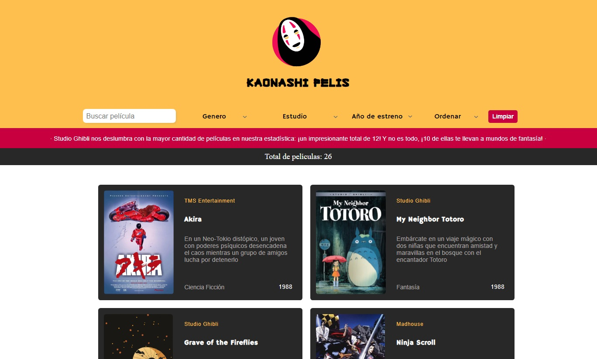

# Analizador de texto

## Índice

* [1. Introducción](#1-Introducción)
* [2. Inicio del proyecto](#2-inicio-del-proyecto)
* [3. Historias de usuario](#3-Historias de usuario) 
* [4. Prompting](#4-prompting)
* [5. Prototipo](#5-prototipo)
* [6. Consideraciones técnicas](#6-consideraciones-técnicas)
* [7. Test unitarios](#7-test-unitarios)
* [8. Proyecto](#8-proyecto)

***

## 1. Introducción

En el desarrollo de este proyecto, empleamos técnicas de prompting utilizando herramientas de inteligencia artificial como ChatGPT y creamos un conjunto de datos en un archivo JavaScript. El resultado obtenido es una página web  que visualiza los datos de las películas de animación japonesa, brindando la capacidad de aplicar filtros, ordenar la información y realiza cálculos estadísticos.

## 2. Inicio del proyecto

Comenzamos definiendo la temática de nuestro proyecto, que se enfoca en películas de animación japonesa. Para comprender mejor las necesidades de los usuarios, respondimos preguntas clave sobre quiénes son los principales usuarios, cuáles son sus objetivos, y qué datos son más relevantes para ellos. Esto nos proporcionó una guía clara para el desarrollo del proyecto.

## 3. Historias de Usuario

- Como amantes de las películas de animación japonesa, queremos buscar información detallada sobre cada película para conocer sus características.

- Deseamos filtrar películas por nombre, estudio de animación y año para encontrar fácilmente la información deseada.

- Queremos ordenar películas en forma ascendente o descendente según nuestras preferencias.

## 4. Prompting

Realizamos consultas a la inteligencia artificial para obtener datos específicos sobre las mejores películas de animación japonesa en los años 90. Se adaptaron las respuestas para generar el archivo dataset.js.

Ejemplo de técnica de prompting aplicada:

    "Tienes la informacion de las mejores peliculas de animacion japonesa 
	en los años de 90s , podrías darme una lista de las 24 mejores peliculas 
	de animacion japonesa de ese año?

    Podrías darme esta información organizada de la siguiente manera: 

    export default [
    {
     "id": "ada-lovelace",
    "name": "Ada Lovelace",
    "shortDescription": "Pionera de la informática, fue la primera programadora.",
    "description": "Una visionaria del siglo XIX ...",
    "imageUrl": "URL_DE_LA_IMAGEN_GENERADA",
    "facts": {
      "yearOfBirth": 1843,
      "placeOfBirth": "London, England",
      "mainField": "Computer Science",
    }
    },]"

Listado de películas generado por la IA (usando ChatGPT)

<br>

## 5. Prototipos

Creamos wireframes y mockups para visualizar y planificar las características gráficas del proyecto, donde pudimos identificar las diferentes caracteristicas graficas de nuestro proyecto.</p>

Wireframe


Mockup

<br>

## 6. Consideraciones técnicas

La lógica del proyecto esta implementada completamente en JavaScript
(ES6), HTML y CSS. En este proyecto se utilizo solo vanilla JavaScript.

El _boilerplate_ contiene una estructura de archivos así como toda la configuración de dependencias:

```text
.
├── README.md
├── package.json
├── src
|  ├── data
|  |  └── dataset.js (La que hayas generado con la IA)
|  ├── dataFunctions.js
|  ├── view.js
|  ├── index.html
|  ├── main.js
|  └── style.css
└── test
   └── data.js
   └── dataFunctions.spec.js
   └── tests-read-only

```

El corazón de este proyecto es la manipulación de datos a través de arreglos
y objetos.

El proyecto tiene funcionalidades que corresponda
a obtener, procesar y manipular datos (funciones). Por ejemplo:</p>

* `filterData(data, filterBy, value)`: esta función recibe tres parámetros.

	El primer parámetro, `data`, nos entrega los datos.
	El segundo parámetro, `filterBy`, nos dice con respecto a cuál de los               campos   de la data se quiere filtrar.
	El tercer parámetro, `value`, indica el valor de campo que queremos         	filtrar.- 

* `sortData(data, sortBy, sortOrder)`: esta función `sort` u ordenar recibe tres parámetros.

	El primer parámetro, `data`, nos entrega los datos.
	El segundo parámetro, `sortBy`, nos dice con respecto a cuál de los 	           campos   de la data se quiere ordenar.
	El tercer parámetro, `sortOrder`, indica si se quiere ordenar de manera           ascendente o descendente.

* `computeStats(data)`: la función `compute` o calcular, nos permite hacer          cálculos estadísticos básicos para ser mostrados de acuerdo a la data
   proporcionada, esta función debe usar el método reduce.

## 7. Test Unitarios

Se desarrollaron pruebas unitarias para garantizar el correcto funcionamiento de las funciones implementadas en dataFunctions.js.

<br>

## 8. Proyecto

La funcionalidad principal del sitio consiste en filtrar las películas de animación japonesa según el género, estudio y año de lanzamiento. Además, se ofrece la opción de ordenarlas de manera ascendente o descendente, así como la posibilidad de buscarlas directamente por su nombre en el buscador proporcionado. El botón "limpiar", como su nombre lo indica, permite limpiar los filtros implementados. 

Adicional a esto, cuenta con una estadística que evalúa el estudio con mayor número de películas y el género que más destaca, así como un contador que muestra en tiempo real las películas exhibidas según los diferentes filtros implementados. De esta manera, se obtiene un sitio de fácil manipulación y comprensión para el usuario.

